# Explaining and Exploring Python
**Chelsea Morris**

The purpose of this tutorial is to give a brief explanation of Python, as well as get you on your way to writing you first line of code! This tutorial will be beneficial for those who know little to nothing about the language but would like to expand their knowledge and briefly explore the awesome things that Python has to offer! The main focus is to take you through the downloading process of Python Idle, however, there will be several topics covered (many of which are strictly BASIC coverings and will NOT go into depth). Some of the following topics will be covered:

* What is Python?
* Who uses Python? 
* Pros and Cons
* Some basic terms used in Python
* Downloading Process
* How to write your first line of code! 
* Additional Python links

# What is Python?

Python is a beginner-friendly, high-level programming language. Because Python is fairly easy to learn, it is the perfect programming language to get you started on your journey to becoming a programmer.  

# Who uses Python?

Python can be used for a variety of things, making it a general purpose language. For example, some use python to write scripts, develop web pages, or analyze data, while others use it to put in robots or for math/machine learning. 
https://www.quora.com/What-is-Python-primarily-used-for  

Python is best for creating solutions to complex issues quickly and efficiently. Plenty of large and popular companies use python in some way, including, but not limited to: 

* Instagram
* Amazon
* Facebook
* Google
* YouTube
* NASA

https://www.quora.com/What-top-tier-companies-use-Python 

| Pros                                                  | Cons                                                                               |
|-------------------------------------------------------|------------------------------------------------------------------------------------|
| Easy to learn and read for beginners                  | Not good for mobile development                                                    |
| Supports multiple systems                             | Not a good choice for memory intensive tasks.                                      |
| A large number of resources are available for Python. | Not ideal in game development. Extremely difficult to build a high-graphic 3D game |

https://www.supinfo.com/articles/single/3425-the-pros-and-cons-of-python 

In summary, Python is not the best choice when it comes to large scale mobile/game development. However, it has a range of potential uses and is great first language to learn for those who are new to programming (which, if you are reading this, you likely are!).

Before we get started on the downloading process , we will first go over the keywords of Python

# Python Keywords

|          |         |        |          |       |
|----------|---------|--------|----------|-------|
| and      | del     | from   | None     | True  |
| as       | elif    | global | nonlocal | try   |
| assert   | else    | if     | not      | while |
| break    | except  | import | or       | with  |
| class    | False   | in     | pass     | yield |
| continue | finally | is     | raise    |       |
| def      | for     | lambda |          |       |

Although these words may not mean much to you now, as you continue your Python journey they will quickly become your best friends! 

# Downloading Process MacOS

To begin the downloading process for MacOS, click this link.  https://www.python.org/downloads/. 

You will then be taken to a website where your screen should appear like this

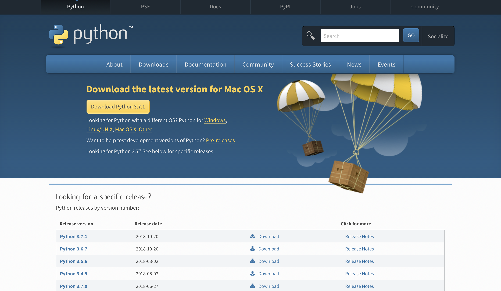

You will then want to click “Download Python 3.7.1” 

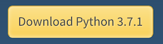 

Python will then begin its download in the upper right hand corner of your screen 

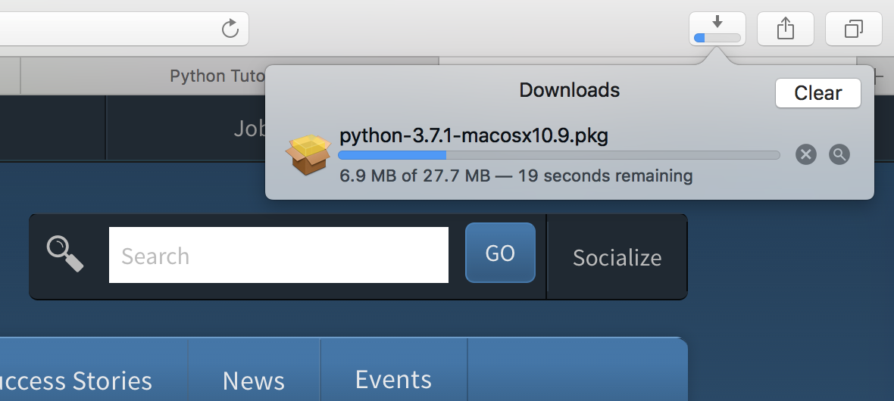

When the download is complete, double click “Python- 3.7.1-macosx10.9.pkg” and a pop up will appear 

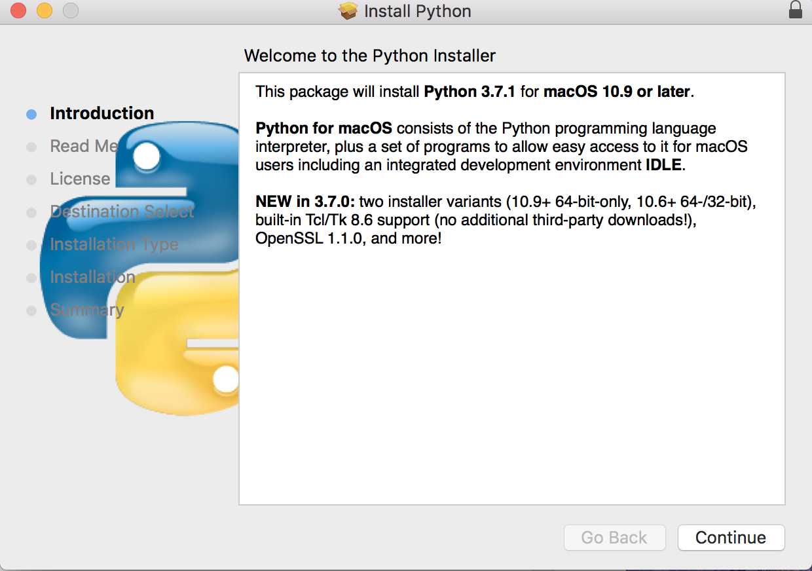

Click continue and read all of the necessary information. (it should walk you through it) and when completed, your screen should look like this 

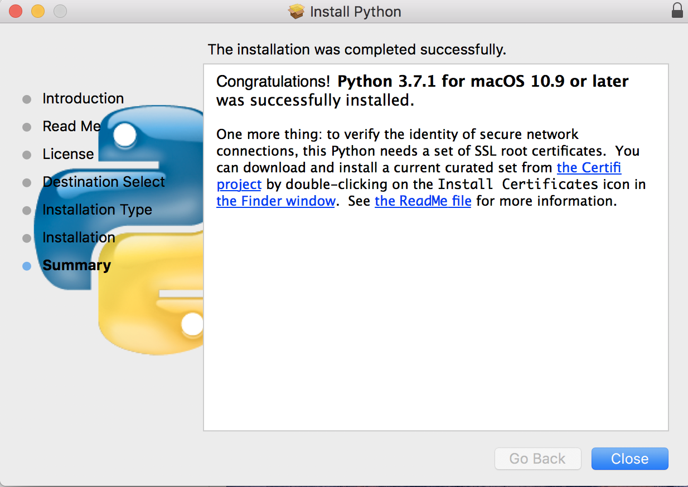

Click “Close” and then “move to trash”

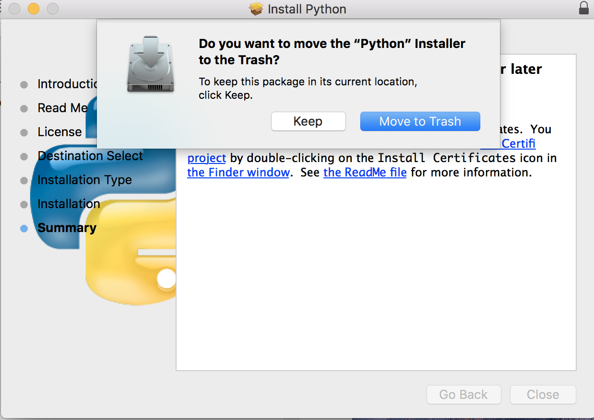

Open finder on your macbook and go to Applications and locate the Python 3.7 folder

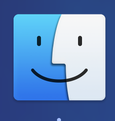
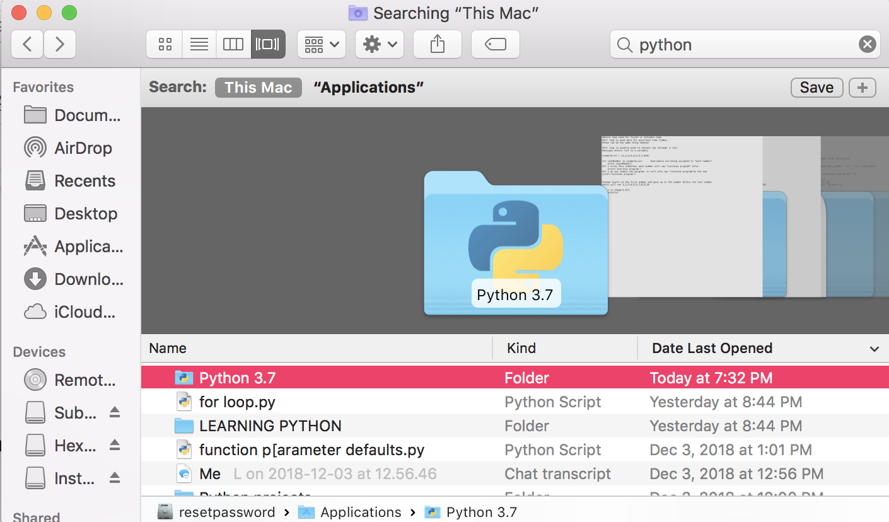

Once opened, locate the Idle icon and double click

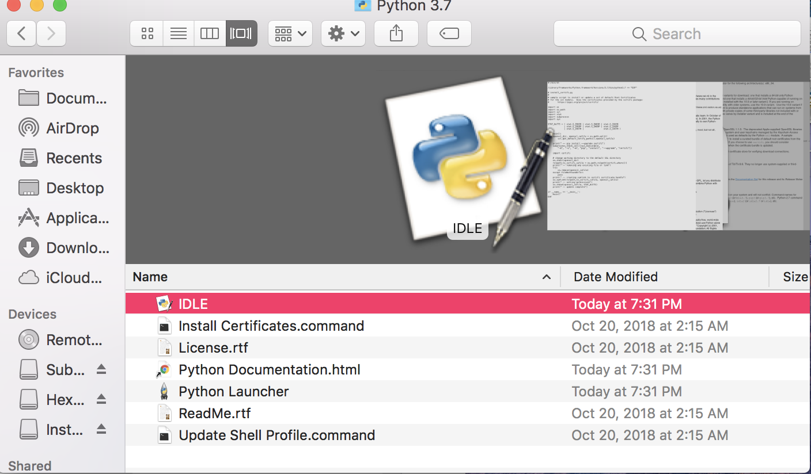

Once launched, you have completed downloading Python Idle! 

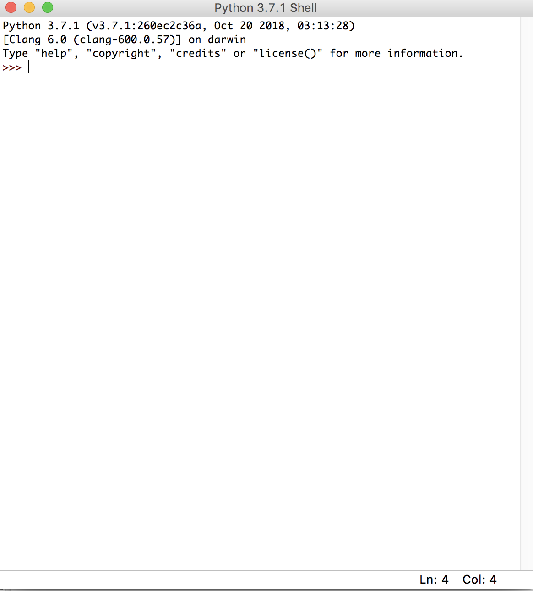

# How to write first line of code

Now that you have Python Idle up and running, it is time to write your first line of code! A typical first program is called the “Hello World!” program. 

**Before we begin… History on “Hello world!”**

Although there is no record on when the program was first used, it is a program that is very simple to write in almost all programming languages.  It is oftentimes the first program that people learning a new language write and is used to illustrate the basic syntax of a programming language. It is used to test things out to make sure that the computer language is installed correctly. According to Wikipedia it was influenced by an example program in the book “The C Programming Language.” 

**Now we begin!**

When you first launch Python idle, the Python Shell will appear. This is where you can enter python code in interactive mode.  This means that you can type lines of code and press enter and they will immediately be displayed. The code written in the python shell will not be saved. It is a great place to learn how python statements execute. See image below 

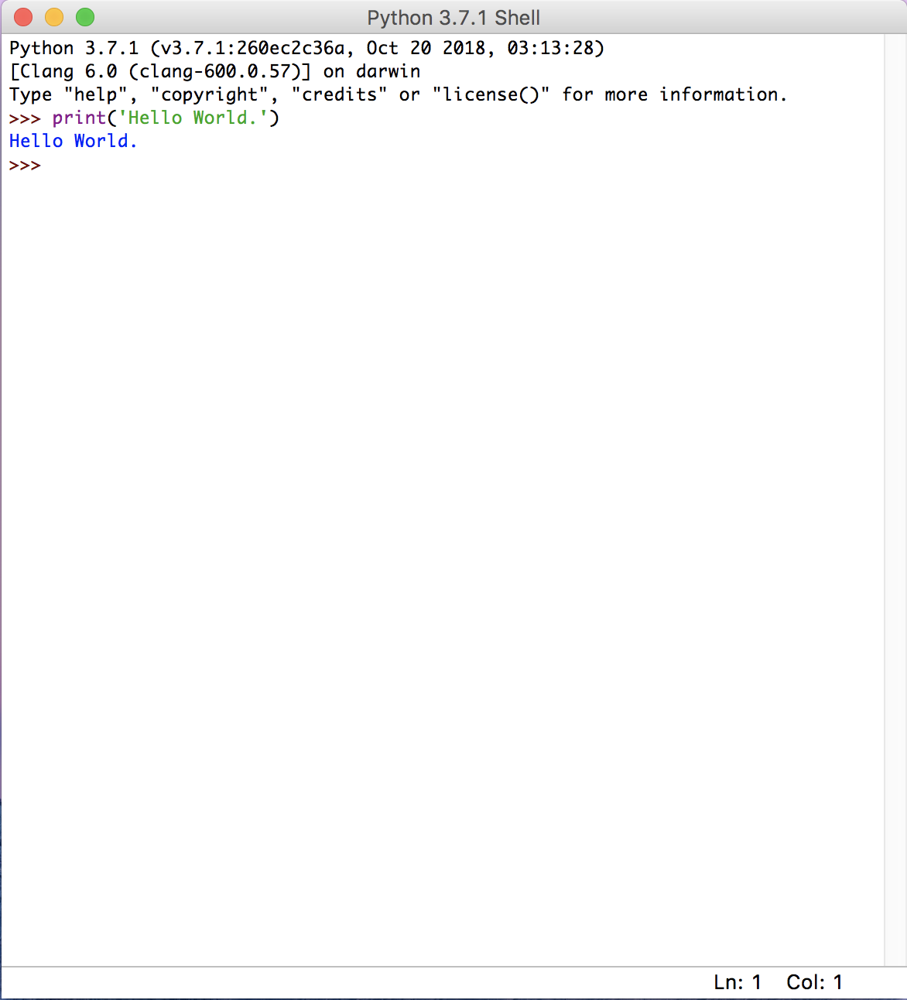

If you are wanting to write a program that can be executed when you want, you are going to have to write the code and save it as a file. To do so, you go to file in the upper left hand corner of the screen and click “New file.” When you do that, a blank window will appear as shown below. 

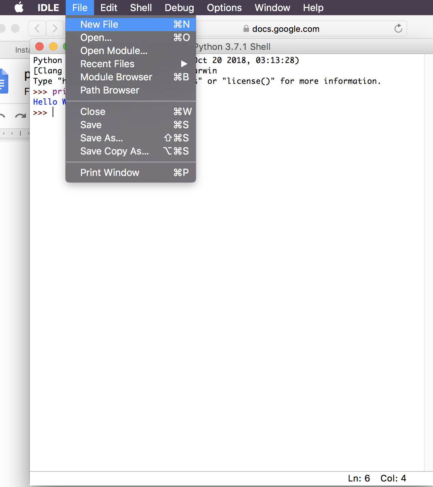

Before typing your code, you are going to want to save the file and give it an appropriate title. In this case, we will name our file HelloWorld. You can save your file to any document you would like, but I would strongly recommend making a New Folder and storing your file inside. 

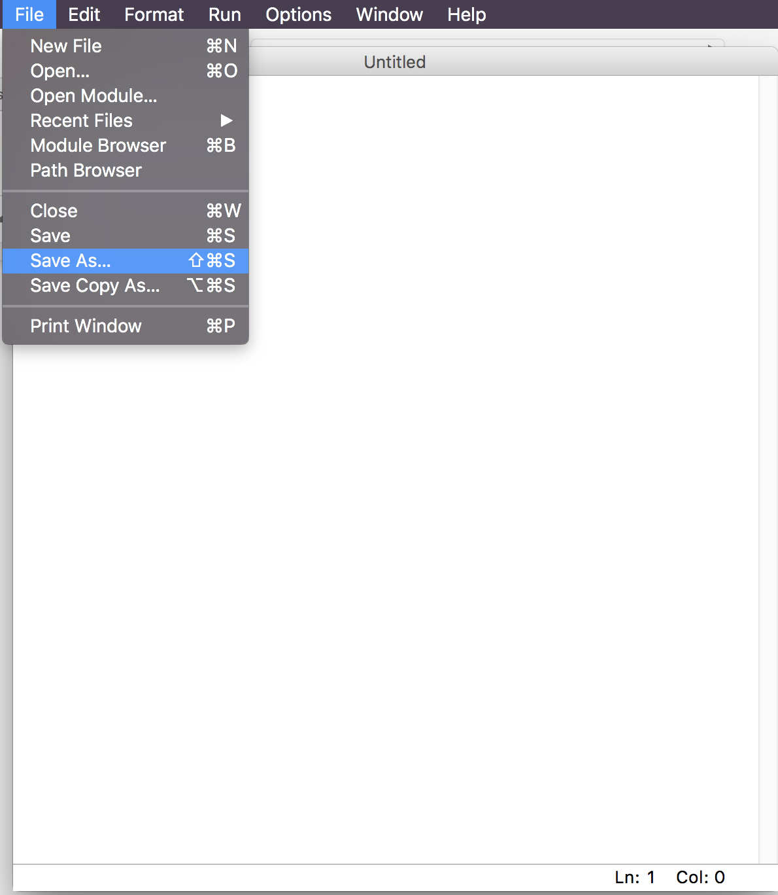

Now that you have your file saved, you can begin typing your first line of code. You will want to begin by using the print function and typing print(‘Hello World!’) as shown below. 

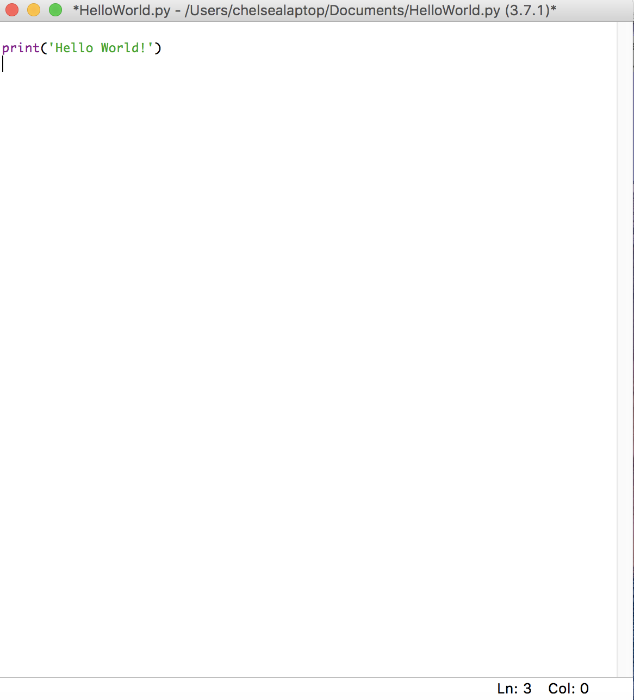

Save the file when you finish writing the code.  To run the program you go to Run at the upper left hand corner of your screen and go to “Run Module.”

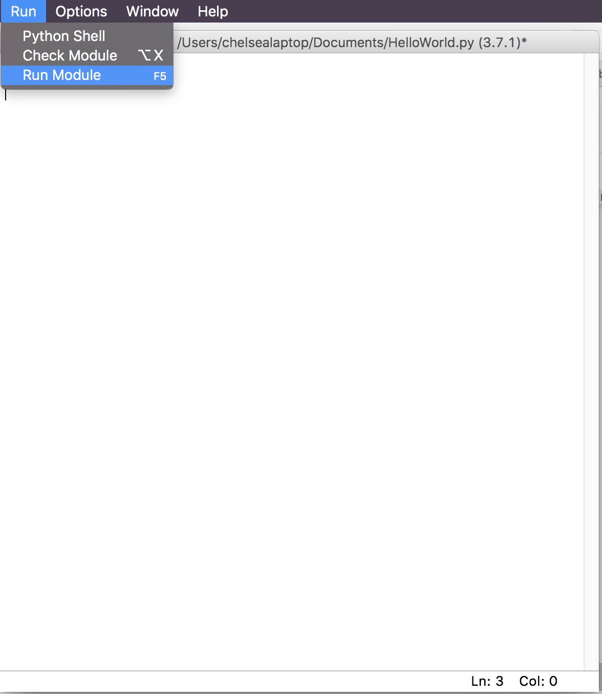

After you do that, you have officially written and executed your first line of code!!

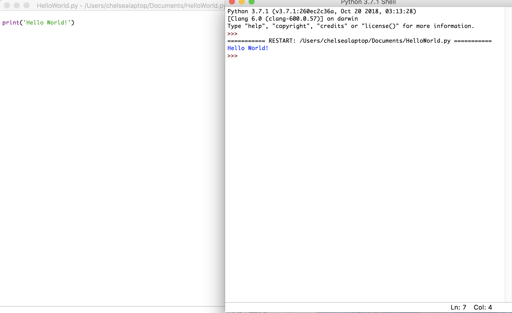

**CONGRATULATIONS!!!  You have started your journey to becoming a great programmer!**

# What now?
If you enjoyed this tutorial and would like to further your Python knowledge there are an unlimited amount of resources that will help you do so! 

**Additional Resources**

Book
-----
* Starting out with Python https://www.amazon.com/Starting-Out-Python-Tony-Gaddis/dp/0134444329/ref=sr_1_1?ie=UTF8&qid=1544154831&sr=8-1&keywords=starting+out+with+python 

Articles
-------
* What is python? https://www.python.org/doc/essays/blurb/ 
* What is python? https://en.wikipedia.org/wiki/Python_(programming_language) 
* How to download Python: https://realpython.com/installing-python/ 

Videos
-------
* Writing your first program: https://www.youtube.com/watch?v=1Xml6EIIKh0&feature=youtu.be 
* Python Tutorials: (both articles and videos included) https://pythonprogramming.net/introduction-to-python-programming/ 

